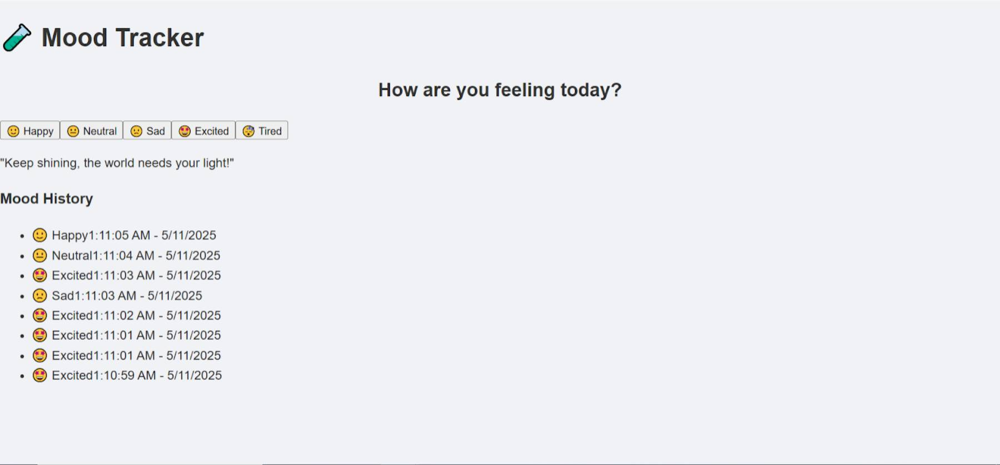

## 🧪 Practical Project 1: **Mood Tracker**

### 🧭 Project Objective:

Build a simple **Mood Tracker** where users can select their current mood (Happy, Sad, Neutral, etc.), view a log of recent moods, and see a motivational quote based on their mood. This project will utilize modern React practices with `react-strict-dom` and its integrated styling capabilities.

---

### ✅ Concepts Reinforced & Introduced:

| Concept                        | Application                                                                  |
| ------------------------------ | ---------------------------------------------------------------------------- |
| **React Concepts**             | Functional components, JSX for UI structure, props for data/callback passing, state (`useState`) for managing dynamic data (current mood, mood history), and hooks (`useEffect`) for side effects (simulated quote fetch). |
| **Component-Based Architecture** | Designing the UI by composing smaller, reusable components (`MoodSelector`, `MoodLog`, `MotivationalQuote`). |
| **`react-strict-dom`**         | All visual elements are constructed using `react-strict-dom`'s `html.div`, `html.button`, `html.p`, etc., promoting a specific and consistent way to build DOM structures in React. |
| **Styling with `css` from `react-strict-dom`** | Component-level styling achieved using `css.create()` to define style objects and `style={styles.yourStyle}` (or optionally `css.props()`) to apply them. This leverages StyleX for optimized, co-located styles. |
| **TypeScript Integration**     | Using types for props, state, and data structures (enums like `Mood`, type aliases like `MoodEntry`) to enhance code clarity and catch errors early. |
| **Vite & Build Setup**         | Understanding basic project scaffolding with Vite, and configuring Vite with necessary plugins (e.g., `vite-plugin-stylex`) to support the chosen styling solution. |
| **Event Handling**             | Capturing and responding to user interactions, such as button clicks for mood selection. |
| **Simulated Asynchronicity**   | Using `setTimeout` within a `useEffect` hook to mimic the behavior of fetching data from an external source. |

---

### 🛠 Project Features:

1.  **`MoodSelector` Component**
    *   Presents a list of selectable mood options (e.g., 🙂 Happy, 😐 Neutral, 🙁 Sad).
    *   When a mood is selected, it communicates this choice to the parent component (`App.tsx`) using a callback prop.
    *   Visually indicates the currently selected mood.

2.  **`MoodLog` Component**
    *   Displays a chronological list of moods previously selected by the user.
    *   Each entry in the log includes the mood and the timestamp of when it was recorded.
    *   Shows a message if no moods have been logged yet.

3.  **`MotivationalQuote` Component**
    *   Displays a motivational quote.
    *   The quote displayed is dynamically chosen based on the user's currently selected mood.
    *   Simulates fetching this quote asynchronously using `useEffect` and `setTimeout`.
    *   Shows a loading indicator while the quote is being "fetched."

---

### 📁 Final Project File Structure:

```
/mood-tracker/
├── public/                     // For static assets like favicon.ico
├── src/
│   ├── components/             // Directory for reusable React components
│   │   ├── MoodSelector.tsx
│   │   ├── MoodLog.tsx
│   │   └── MotivationalQuote.tsx
│   ├── styles/                 // Directory for styling-related files
│   │   └── theme.ts            // Contains theme constants (colors, spacing, etc.)
│   ├── types/                  // Directory for TypeScript type definitions
│   │   └── mood.ts
│   ├── utils/                  // Directory for utility functions and data
│   │   └── quotes.ts
│   ├── App.tsx                 // The main application component, orchestrates other components
│   ├── main.tsx                // The entry point of the React application
│   └── global.css              // Global CSS styles for the application
├── .eslintrc.cjs               // Configuration for ESLint (code linter)
├── index.html                  // The main HTML file that hosts the React app
├── package.json                // Defines project metadata, scripts, and dependencies
├── tsconfig.json               // TypeScript compiler options for the project
├── tsconfig.node.json          // TypeScript compiler options for Node.js specific files (like vite.config.ts)
└── vite.config.ts              // Configuration file for the Vite build tool
```

---

### 💡 Key Learning Points & New Concepts to Emphasize:

*   **Strict DOM Usage:** Consistent use of `html.<element>` from `react-strict-dom` for all rendered elements.
*   **`css.create()` for Styling:** Understanding how to define co-located styles using `css.create()` and apply them (primarily via `style={...}`, with awareness of `css.props()` for advanced cases).
*   **Vite Plugin Configuration:** Learning the necessity of `vite-plugin-stylex` to make `css.create()` work by enabling the underlying StyleX compilation.
*   **Dependency Management:** Navigating and resolving peer dependency issues (as was done for React, `@stylexjs/stylex`, and Vite versions) to achieve a stable build environment.
*   **Type Safety with Enums and Types:** Defining clear data structures like `Mood` (enum) and `MoodEntry` (type alias) in `types/mood.ts`.
*   **Props with Explicit Types:** Ensuring all components have clearly defined prop types using TypeScript interfaces.
*   **State Management with `useState`:** Tracking `currentMood` and `moodHistory` effectively.
*   **Side Effects with `useEffect`:** Simulating asynchronous operations and understanding dependency arrays and cleanup functions.

---

### 🖥️ Example UI:


